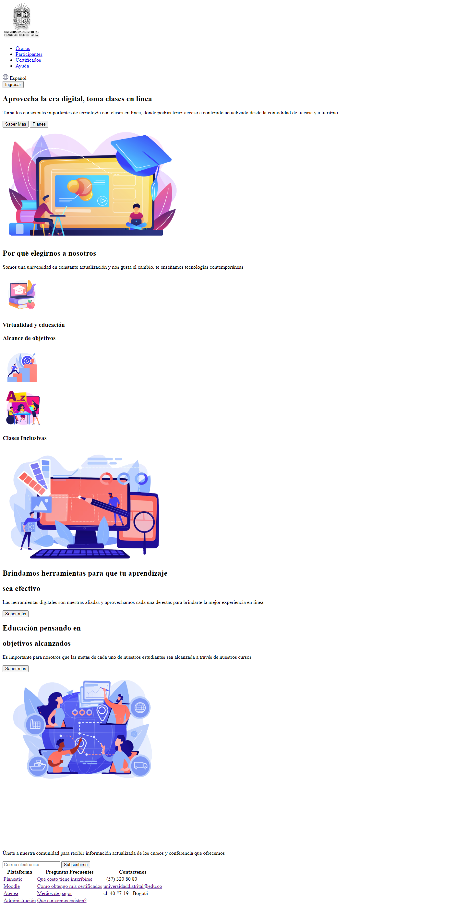
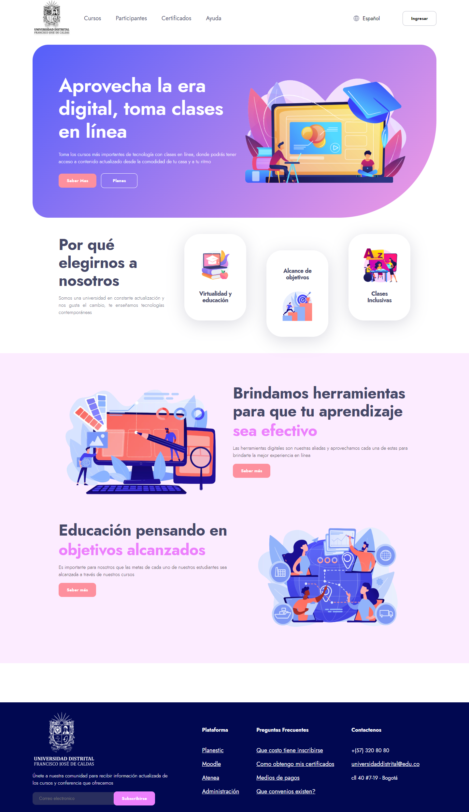
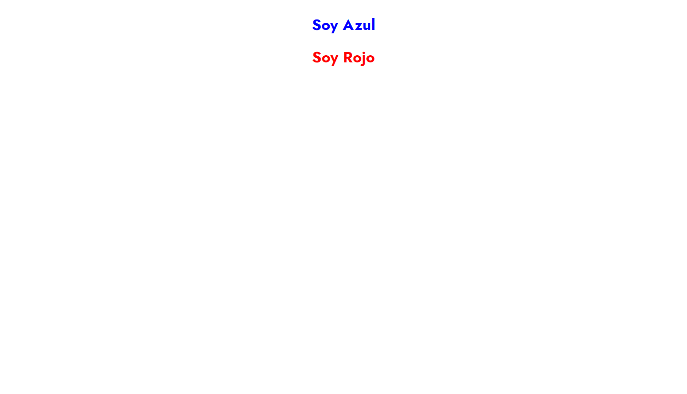
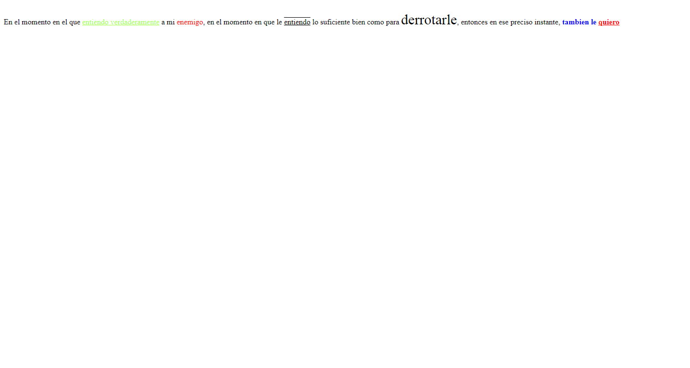

<h1> Taller Elian Marin</h1>

<h2>Informacion</h2>

Curso: Full Stack Basico - Grupo 1

Profesor: Cristian Patiño

<h2> Punto 1: Link de figma</h2>
<a href="https://www.figma.com/file/imV5A9GR0vjIRIQcVF01Rm/Untitled?type=
design&node-id=0-1&t=zA0AKLTV1LSnfdu7-0">Link de Figma </a>

 

<h2> Punto 2: Html</h2>

<h2> Punto 3: Css</h2>

<h2> Punto 4: Titulos</h2>

<h2> Punto 5: Estilos de texto</h2>
